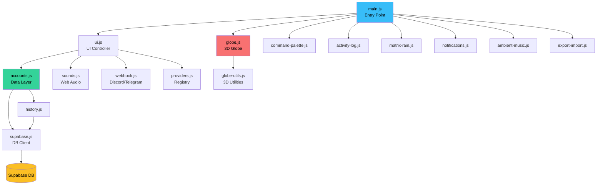

# 🔍 Analisis Lengkap: Vibe Code Monitor

## 1. Ringkasan Project

**Vibe Code Monitor** adalah dashboard real-time untuk memonitor status dan kuota akun AI Coding (Claude, Cursor, ChatGPT, Gemini, Windsurf, Copilot). Dibangun dengan **Vanilla JS + Vite**, menggunakan **Three.js** untuk globe 3D, **GSAP** untuk animasi, dan **Supabase** untuk database.

| Aspek | Detail |
|-------|--------|
| **Total File** | 17 source files + [index.html](file:///e:/DATA/Ngoding/vibecode-monitor/index.html) |
| **Total Lines of Code** | ~5,600+ (JS) + 2,300 (CSS) + 377 (HTML) ≈ **8,300 baris** |
| **Dependencies** | [three](file:///e:/DATA/Ngoding/vibecode-monitor/src/globe-utils.js#389-401) (3D), `gsap` (animasi), `@supabase/supabase-js` (DB) |
| **Build Tool** | Vite 7.3.1 |
| **Deploy** | GitHub Pages + Vercel support |

---

## 2. Arsitektur & Data Flow



### Alur Data Utama:
1. [main.js](file:///e:/DATA/Ngoding/vibecode-monitor/src/main.js) → Boot semua modul
2. [ui.js](file:///e:/DATA/Ngoding/vibecode-monitor/src/ui.js) → Fetch data via [accounts.js](file:///e:/DATA/Ngoding/vibecode-monitor/src/accounts.js) → Render sidebar cards
3. [accounts.js](file:///e:/DATA/Ngoding/vibecode-monitor/src/accounts.js) → CRUD ke Supabase + Realtime sync
4. [globe.js](file:///e:/DATA/Ngoding/vibecode-monitor/src/globe.js) → Visualisasi 3D berdasarkan data akun
5. Perubahan data → Callback ke [globe.js](file:///e:/DATA/Ngoding/vibecode-monitor/src/globe.js) untuk update visual

---

## 3. Fitur-Fitur yang Sudah Ada

### ✅ Core Features
| # | Fitur | File | Status |
|---|-------|------|--------|
| 1 | CRUD Akun (Add/Edit/Delete) | [accounts.js](file:///e:/DATA/Ngoding/vibecode-monitor/src/accounts.js), [ui.js](file:///e:/DATA/Ngoding/vibecode-monitor/src/ui.js) | ✅ |
| 2 | Live Countdown Timer (RAF) | [ui.js](file:///e:/DATA/Ngoding/vibecode-monitor/src/ui.js) | ✅ |
| 3 | Auto-Status Update (limited→available) | [ui.js](file:///e:/DATA/Ngoding/vibecode-monitor/src/ui.js) | ✅ |
| 4 | Realtime Sync (multi-tab/device) | [accounts.js](file:///e:/DATA/Ngoding/vibecode-monitor/src/accounts.js) | ✅ |
| 5 | Search & Sort (debounced) | [ui.js](file:///e:/DATA/Ngoding/vibecode-monitor/src/ui.js) | ✅ |
| 6 | Filter by Status & Provider | [ui.js](file:///e:/DATA/Ngoding/vibecode-monitor/src/ui.js) | ✅ |
| 7 | Bulk Actions (Select Mode) | [ui.js](file:///e:/DATA/Ngoding/vibecode-monitor/src/ui.js) | ✅ |
| 8 | Export/Import JSON Backup | [export-import.js](file:///e:/DATA/Ngoding/vibecode-monitor/src/export-import.js) | ✅ |
| 9 | Multi-Provider Support | [providers.js](file:///e:/DATA/Ngoding/vibecode-monitor/src/providers.js), [ui.js](file:///e:/DATA/Ngoding/vibecode-monitor/src/ui.js) | ✅ |

### ✅ Immersion & UX
| # | Fitur | File | Status |
|---|-------|------|--------|
| 10 | 3D Globe + Light Pillars | [globe.js](file:///e:/DATA/Ngoding/vibecode-monitor/src/globe.js) | ✅ |
| 11 | Cinematic Camera Focus | [globe.js](file:///e:/DATA/Ngoding/vibecode-monitor/src/globe.js) | ✅ |
| 12 | 3D Active Highlight (Halo) | [globe.js](file:///e:/DATA/Ngoding/vibecode-monitor/src/globe.js) | ✅ |
| 13 | Spatial Audio (Stereo Pan) | [sounds.js](file:///e:/DATA/Ngoding/vibecode-monitor/src/sounds.js) | ✅ |
| 14 | Command Palette (Ctrl+K) | [command-palette.js](file:///e:/DATA/Ngoding/vibecode-monitor/src/command-palette.js) | ✅ |
| 15 | Boot Sequence Animation | [main.js](file:///e:/DATA/Ngoding/vibecode-monitor/src/main.js), CSS | ✅ |
| 16 | CRT Scanline Overlay | CSS Shader | ✅ |
| 17 | Matrix Rain (Canvas) | [matrix-rain.js](file:///e:/DATA/Ngoding/vibecode-monitor/src/matrix-rain.js) | ✅ |
| 18 | Ambient Music (Fade in/out) | [ambient-music.js](file:///e:/DATA/Ngoding/vibecode-monitor/src/ambient-music.js) | ✅ |
| 19 | Sound Effects (Web Audio) | [sounds.js](file:///e:/DATA/Ngoding/vibecode-monitor/src/sounds.js) | ✅ |
| 20 | Activity Log Terminal | [activity-log.js](file:///e:/DATA/Ngoding/vibecode-monitor/src/activity-log.js) | ✅ |

### ✅ Notifications
| # | Fitur | File | Status |
|---|-------|------|--------|
| 21 | Browser Notification API | [notifications.js](file:///e:/DATA/Ngoding/vibecode-monitor/src/notifications.js) | ✅ |
| 22 | In-App Notification Center | [notifications.js](file:///e:/DATA/Ngoding/vibecode-monitor/src/notifications.js) | ✅ |
| 23 | Discord Webhook | [webhook.js](file:///e:/DATA/Ngoding/vibecode-monitor/src/webhook.js) | ✅ |
| 24 | Telegram Webhook | [webhook.js](file:///e:/DATA/Ngoding/vibecode-monitor/src/webhook.js) | ✅ |

---

## 4. 🐛 Bug & Issues (Ditemukan)

### 🔴 Kritis

| # | Bug | File | Penjelasan |
|---|-----|------|------------|
| 1 | **[.env](file:///e:/DATA/Ngoding/vibecode-monitor/.env) terexpose di repo** | [.env](file:///e:/DATA/Ngoding/vibecode-monitor/.env) | Supabase URL dan anon key langsung terlihat. Meskipun anon key bersifat "publik", [.env](file:///e:/DATA/Ngoding/vibecode-monitor/.env) seharusnya ada di [.gitignore](file:///e:/DATA/Ngoding/vibecode-monitor/.gitignore). Jika RLS dimatikan, siapapun bisa membaca/menulis/menghapus semua data. |
| 2 | **RLS Disabled** | [supabase.js](file:///e:/DATA/Ngoding/vibecode-monitor/src/supabase.js) (komentar) | Komentar di [supabase.js](file:///e:/DATA/Ngoding/vibecode-monitor/src/supabase.js) secara eksplisit menyebut "RLS di-disable supaya simpel". Ini artinya **siapapun yang punya anon key bisa CRUD data tanpa autentikasi**. |
| 3 | **Import tidak cek duplikat** | [export-import.js](file:///e:/DATA/Ngoding/vibecode-monitor/src/export-import.js) | [handleImport](file:///e:/DATA/Ngoding/vibecode-monitor/src/export-import.js#24-74) selalu membuat akun baru (ID baru). Jika user import file yang sama 2x, semua akun akan terduplikasi. |

### 🟡 Sedang

| # | Bug | File | Penjelasan |
|---|-----|------|------------|
| 4 | **`notifiedIds` reset saat refresh** | [ui.js](file:///e:/DATA/Ngoding/vibecode-monitor/src/ui.js) | Set `notifiedIds` hilang saat page reload. Jika banyak akun expired bersamaan, reload akan men-trigger notifikasi ulang untuk semua akun tsb. |
| 5 | **[editAccount](file:///e:/DATA/Ngoding/vibecode-monitor/src/main.js#59-60) reset deadline** | [accounts.js](file:///e:/DATA/Ngoding/vibecode-monitor/src/accounts.js) | [toDb()](file:///e:/DATA/Ngoding/vibecode-monitor/src/accounts.js#64-98) selalu menghitung deadline baru dari `Date.now()`. Jika user edit nama saja tanpa mengubah timer, deadline akan di-reset. |
| 6 | **Audio boot hardcoded path** | `main.js:87` | Path `/audio/notification-...mp3` adalah absolute path. Saat deploy ke GitHub Pages (`/vibecode-monitor/`), path ini akan 404. |
| 7 | **Ambient music path juga hardcoded** | `ambient-music.js:16` | Sama seperti di atas, path `/audio/void-protocol-...mp3` tidak memperhitungkan `base` Vite. |
| 8 | **Provider icon paths hardcoded** | [providers.js](file:///e:/DATA/Ngoding/vibecode-monitor/src/providers.js) | Path seperti `/icons/claude-color.svg` tidak memperhitungkan `base` Vite untuk GitHub Pages. |
| 9 | **Globe `getWorldPosition` tanpa update matrix** | [globe.js](file:///e:/DATA/Ngoding/vibecode-monitor/src/globe.js) | `targetPillar.getWorldPosition(targetPos)` dipanggil tanpa `updateWorldMatrix()` terlebih dahulu. Bisa return posisi yang salah jika globe sedang dirotasi. |

### 🟢 Minor

| # | Bug | File | Penjelasan |
|---|-----|------|------------|
| 10 | **[escapeHtml](file:///e:/DATA/Ngoding/vibecode-monitor/src/ui.js#1188-1193) didefinisikan 2x** | [ui.js](file:///e:/DATA/Ngoding/vibecode-monitor/src/ui.js), [command-palette.js](file:///e:/DATA/Ngoding/vibecode-monitor/src/command-palette.js) | Fungsi utilitas yang sama diduplikasi di 2 file. Seharusnya bisa di-centralize. |
| 11 | **Memory leak: event listeners** | `ui.js:538` | `removeEventListener` + `addEventListener` dipanggil setiap kali [renderAccountList](file:///e:/DATA/Ngoding/vibecode-monitor/src/ui.js#384-546). Listener lama tidak bisa di-remove karena bukan referensi fungsi yang sama. Namun karena menggunakan named function [handleCardAction](file:///e:/DATA/Ngoding/vibecode-monitor/src/ui.js#844-889), ini sebenarnya aman. |
| 12 | **`focusGlobeCb` unused variable** | `main.js:39` | `let focusGlobeCb = null;` dideklarasikan tapi tidak pernah di-assign. |
| 13 | **Extra closing `</div>` tag** | `index.html:295` | Ada extra `</div>` setelah confirm overlay yang tidak memiliki pasangan pembuka. |

---

## 5. ⚡ Performance Analysis

### Positif 👍
- **RAF Throttling:** Countdown timer hanya update setiap 1000ms, bukan setiap frame
- **Matrix Rain:** Frame skipping setiap 80ms
- **Canvas pixelRatio:** Dibatasi max 2 untuk performa
- **Debounced Search:** 200ms debounce mencegah re-render berlebihan
- **Passive Event Listeners:** Digunakan untuk scroll dan pointer events
- **`hardware acceleration`:** Renderer setup `powerPreference: 'high-performance'`

### Perlu Perhatian ⚠️
| Area | Issue |
|------|-------|
| **DOM Re-render** | [renderAccountList](file:///e:/DATA/Ngoding/vibecode-monitor/src/ui.js#384-546) melakukan full `innerHTML` replacement setiap kali. Dengan 28+ akun, ini bisa menyebabkan layout thrashing. Virtual DOM atau incremental update akan lebih efisien. |
| **Globe Children Iteration** | [highlightActiveAccount](file:///e:/DATA/Ngoding/vibecode-monitor/src/globe.js#1128-1187) melakukan `forEach` pada semua children dari `markupPointGroup` (4 meshes × 28 akun = ~112 objects) setiap kali. Bisa dioptimasi dengan Map/index. |
| **[style.css](file:///e:/DATA/Ngoding/vibecode-monitor/src/style.css) Size** | 2,303 baris / 48KB CSS dalam satu file. Bisa dipecah per komponen. |
| **Three.js Bundle** | Three.js penuh (±600KB gzipped) di-import. Bisa lebih kecil dengan tree-shaking jika hanya import modul yang dibutuhkan. |

---

## 6. 🔒 Security Analysis

| # | Risiko | Severity | Detail |
|---|--------|----------|--------|
| 1 | **Supabase credentials exposed** | 🔴 HIGH | [.env](file:///e:/DATA/Ngoding/vibecode-monitor/.env) file berisi URL + anon key. File ini **tidak ada di [.gitignore](file:///e:/DATA/Ngoding/vibecode-monitor/.gitignore)**! |
| 2 | **RLS disabled** | 🔴 HIGH | Siapapun dengan anon key = full access ke semua data |
| 3 | **No input sanitization** | 🟡 MED | [escapeHtml](file:///e:/DATA/Ngoding/vibecode-monitor/src/ui.js#1188-1193) digunakan untuk display, tapi data masuk ke Supabase tanpa validasi server-side |
| 4 | **Webhook tokens di localStorage** | 🟡 MED | Discord URL dan Telegram token disimpan di `localStorage` tanpa enkripsi |
| 5 | **XSS via `innerHTML`** | 🟢 LOW | [escapeHtml](file:///e:/DATA/Ngoding/vibecode-monitor/src/ui.js#1188-1193) sudah digunakan di hampir semua tempat, tapi beberapa tempat masih menggunakan string interpolation langsung (`notes`, `provider badges`) |

---

## 7. 📁 Code Quality

### Positif 👍
- Komentar sangat lengkap dan rapi (JSDoc + penjelasan Bahasa Indonesia)
- Modular architecture (17 file terpisah berdasarkan concern)
- Consistent coding style
- Named functions untuk event handlers (mencegah memory leak)
- Graceful error handling di Supabase calls
- Observer pattern ([onChange](file:///e:/DATA/Ngoding/vibecode-monitor/src/accounts.js#275-282) di [accounts.js](file:///e:/DATA/Ngoding/vibecode-monitor/src/accounts.js)) untuk reactive updates

### Perlu Perbaikan
| Area | Detail |
|------|--------|
| **[globe.js](file:///e:/DATA/Ngoding/vibecode-monitor/src/globe.js) terlalu besar** | 1,321 baris dalam satu file. Bisa dipecah menjadi `globe-scene.js`, `globe-camera.js`, `globe-highlight.js` |
| **[ui.js](file:///e:/DATA/Ngoding/vibecode-monitor/src/ui.js) terlalu besar** | 1,186 baris. Bisa dipecah: `ui-render.js`, `ui-modal.js`, `ui-bulk.js`, `ui-countdown.js` |
| **[style.css](file:///e:/DATA/Ngoding/vibecode-monitor/src/style.css) monolith** | 2,303 baris. Bisa dipecah per komponen: `base.css`, `cards.css`, `modal.css`, `globe.css`, `command-palette.css` |
| **No TypeScript** | Runtime type errors mungkin terjadi (contoh: bug `accountId` string vs number) |
| **No testing** | Tidak ada unit tests atau integration tests |

---

## 8. 📊 Database Schema (Supabase)

Berdasarkan kode, schema yang digunakan:

```sql
-- Main table
CREATE TABLE accounts (
  id UUID PRIMARY KEY DEFAULT gen_random_uuid(),
  name TEXT NOT NULL,
  status TEXT DEFAULT 'available',  -- 'available' | 'limited'
  provider TEXT[] DEFAULT '{}',
  refresh_days INTEGER,
  refresh_hours INTEGER,
  refresh_minutes INTEGER,
  refresh_deadline TIMESTAMPTZ,
  tags TEXT[] DEFAULT '{}',
  notes TEXT DEFAULT '',
  created_at TIMESTAMPTZ DEFAULT NOW()
);

-- History table (opsional)
CREATE TABLE account_history (
  id UUID PRIMARY KEY DEFAULT gen_random_uuid(),
  account_id UUID REFERENCES accounts(id),
  event TEXT,
  old_status TEXT,
  new_status TEXT,
  timestamp TIMESTAMPTZ DEFAULT NOW()
);
```

---

## 9. 🚀 Rekomendasi Peningkatan

### Prioritas Tinggi
1. **Amankan [.env](file:///e:/DATA/Ngoding/vibecode-monitor/.env)** — Pastikan [.env](file:///e:/DATA/Ngoding/vibecode-monitor/.env) ada di [.gitignore](file:///e:/DATA/Ngoding/vibecode-monitor/.gitignore) dan rotasi Supabase keys
2. **Aktifkan RLS** — Buat policy di Supabase agar data terlindungi
3. **Fix asset paths** — Gunakan `import.meta.env.BASE_URL` untuk paths yang deploy-safe
4. **Fix [editAccount](file:///e:/DATA/Ngoding/vibecode-monitor/src/main.js#59-60) deadline reset** — Hanya hitung ulang deadline jika timer fields berubah

### Prioritas Sedang
5. **Pecah file besar** — [globe.js](file:///e:/DATA/Ngoding/vibecode-monitor/src/globe.js) (1,321 LOC), [ui.js](file:///e:/DATA/Ngoding/vibecode-monitor/src/ui.js) (1,186 LOC), [style.css](file:///e:/DATA/Ngoding/vibecode-monitor/src/style.css) (2,303 LOC)
6. **Tambah TypeScript** — Mencegah bug tipe data seperti string vs number
7. **Server-side Cron** — Supabase Edge Function untuk auto-update status tanpa buka web
8. **Responsive design** — Saat ini belum ada media queries untuk mobile/tablet

### Prioritas Rendah
9. **Unit tests** — Minimal untuk [accounts.js](file:///e:/DATA/Ngoding/vibecode-monitor/src/accounts.js) dan [ui.js](file:///e:/DATA/Ngoding/vibecode-monitor/src/ui.js) logic
10. **PWA Support** — Service worker untuk offline access dan push notifications
11. **Dark/Light theme toggle** — CSS variables sudah siap
12. **i18n** — Teks campuran EN/ID, bisa distandarisasi

---

## 10. Kesimpulan

Project ini **sangat impressive** untuk sebuah personal project. Arsitekturnya modular, komentar sangat rapi, dan fitur-fiturnya sangat kaya. Globe 3D dengan spatial audio dan cinematic camera adalah diferensiator yang kuat.

**Kekuatan utama:** UX immersion luar biasa, modular code, full-featured CRUD, realtime sync.

**Kelemahan utama:** Security credentials terexpose, RLS disabled, dan beberapa file terlalu besar untuk maintainability jangka panjang.

> [!TIP]
> Untuk hackathon atau portfolio showcase, project ini sudah sangat siap. Untuk production dengan multi-user, perlu penanganan security terlebih dahulu.
